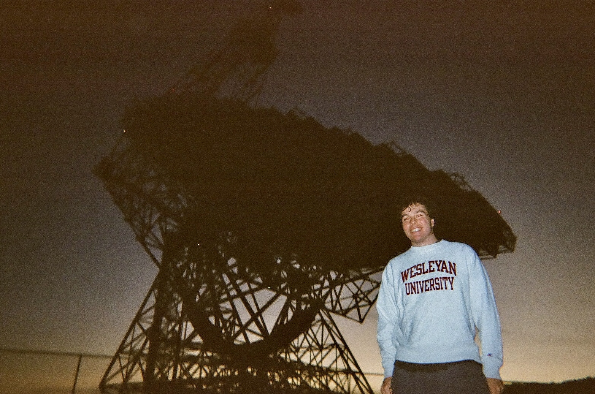

# Introduction

{align="right": style="height:400;width:400px"}

I am currently an MSc student at McGill University, co-supervised by Vicky Kaspi and Jason Hessels. Originally from upstate New York, I graduated from Wesleyan University (Middletown, CT) in 2024 with a degree in Astronomy and Physics. As an undergraduate I completed a thesis project with Seth Redfield on exoplanet population statistics and dynamics. I was also heavily involved in Wesleyan's astronomy outreach though the Van Vleck Observatory, and was a four-year student-athlete on Wesleyan's Swimming and Diving team. 

Over the summer of 2023 I completed a summer Research Experiences for Undergraduates (REU) project at West Virginia University, where I worked with Duncan Lorimer on a population synthesis of repeating Fast Radio Bursts (FRBs). 
This introduced me to this enigmatic class of radio transients, which I continue to study in my graduate work at McGill.

## Other Interests

- [Astrophotography](../astrophotography/index.md)

## CV
<iframe width="100%" height="600" src="./media/kmcgregor_CV.pdf">