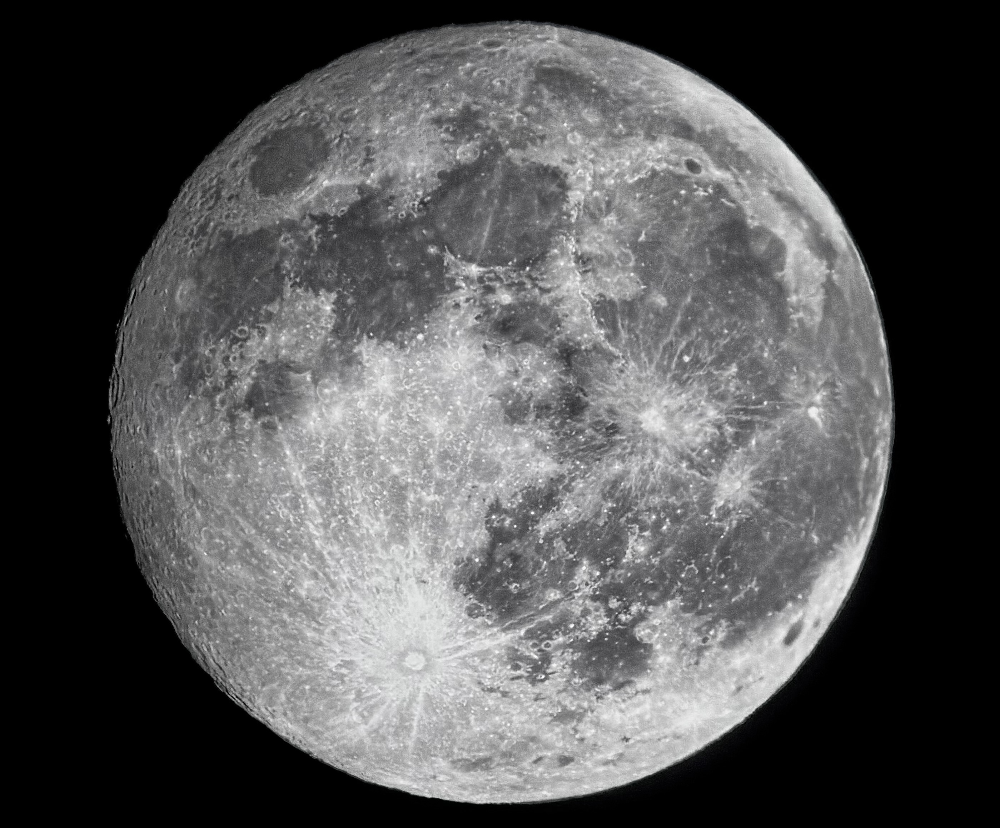
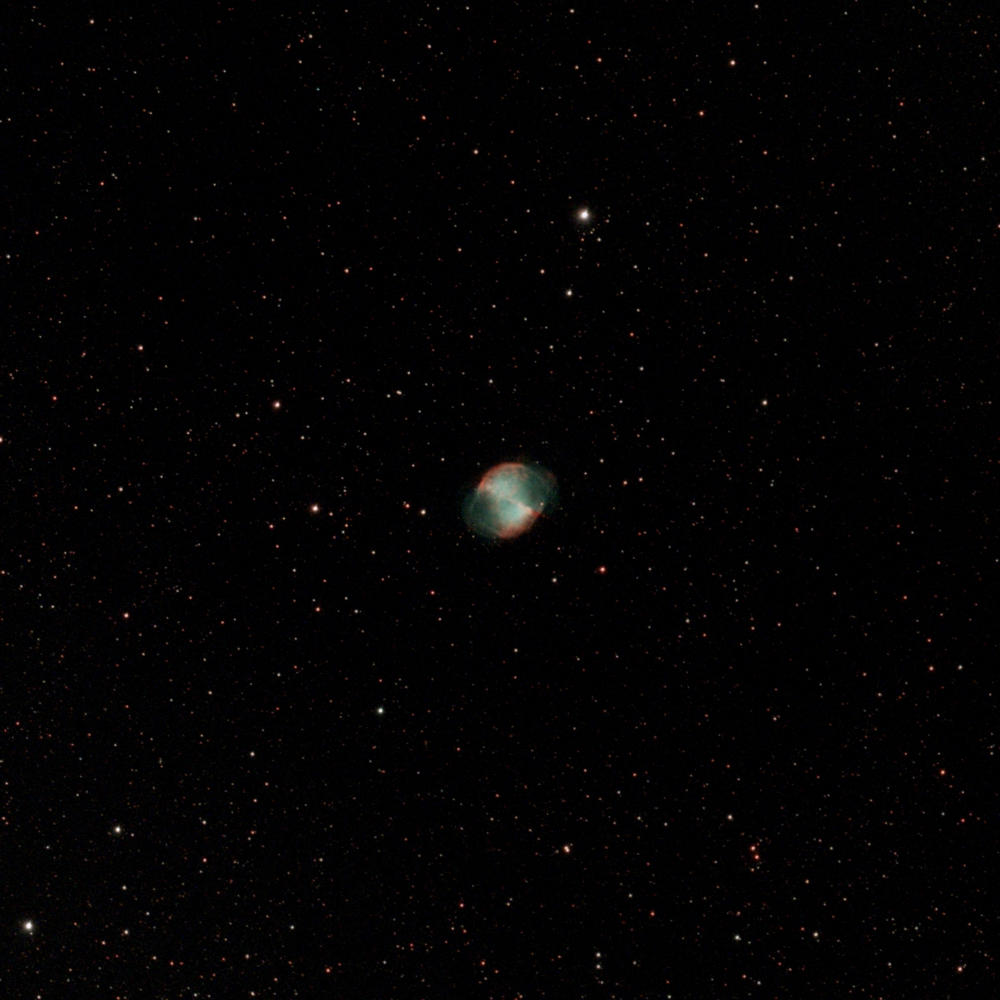
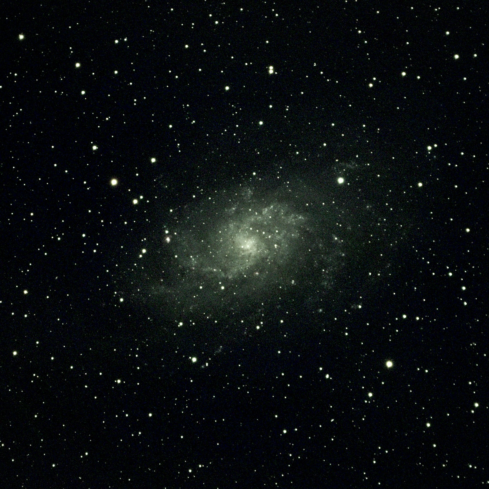
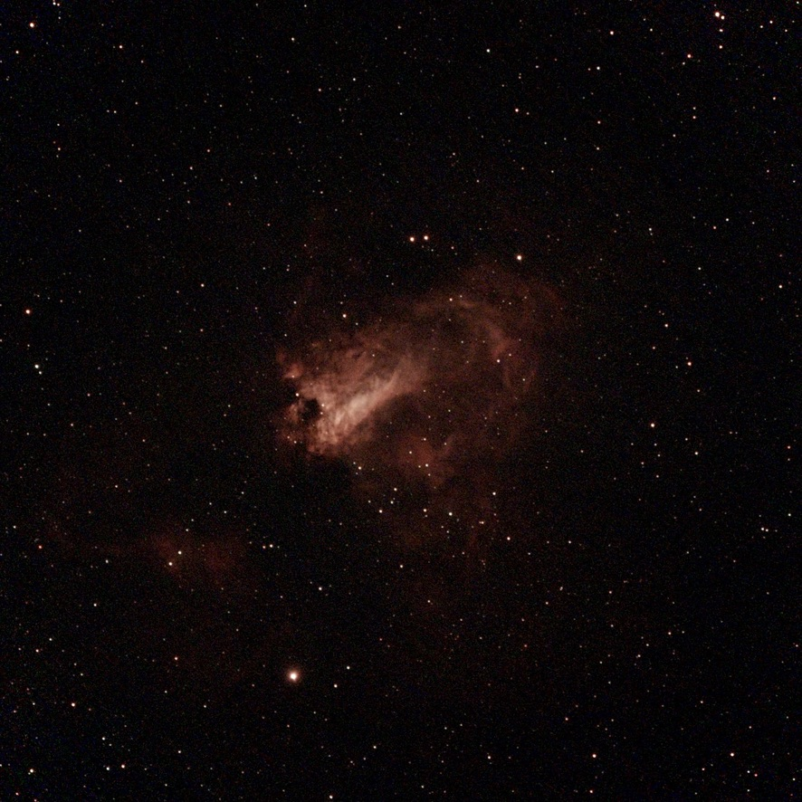

# Astrophotography

In my spare time I am an amateur astrophotographer! Here are some examples of my favorite captures.

## Comet C/2023 A3 (Tsuchinshan-ATLAS)
.JPG "Comet C/2023 A3 (Tsuchinshan-ATLAS)"){align="center": style="height:500;width:500px"}

## The Moon
{align="center": style="height:500;width:500px"}

## Dumbbell Nebula
{align="center": style="height:500;width:500px"}

## Triangulum Galaxy

{align="center": style="height:500;width:500px"}

## Omega Nebula
{align="center": style="height:500;width:500px"}

## North America Nebula

{align="center": style="height:500;width:500px"}