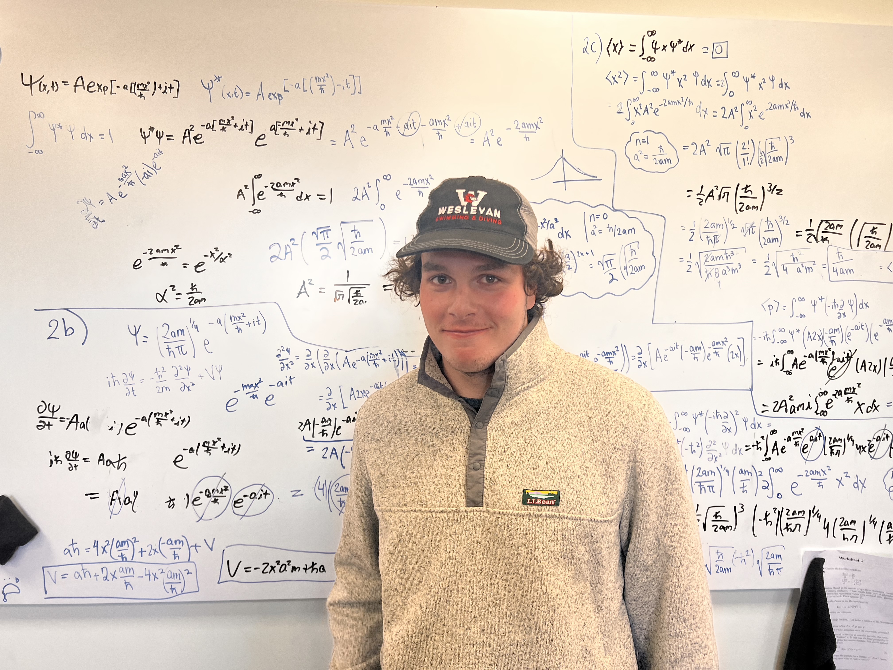

# Projects

{align="right": style="height:400;width:400px"}

Here are some projects that I am working on. 

- [mapper](https://github.com/kmcgregor-1/mapper) is a python library I wrote to easily generate random points in various coordinate systems and cosmological distances.